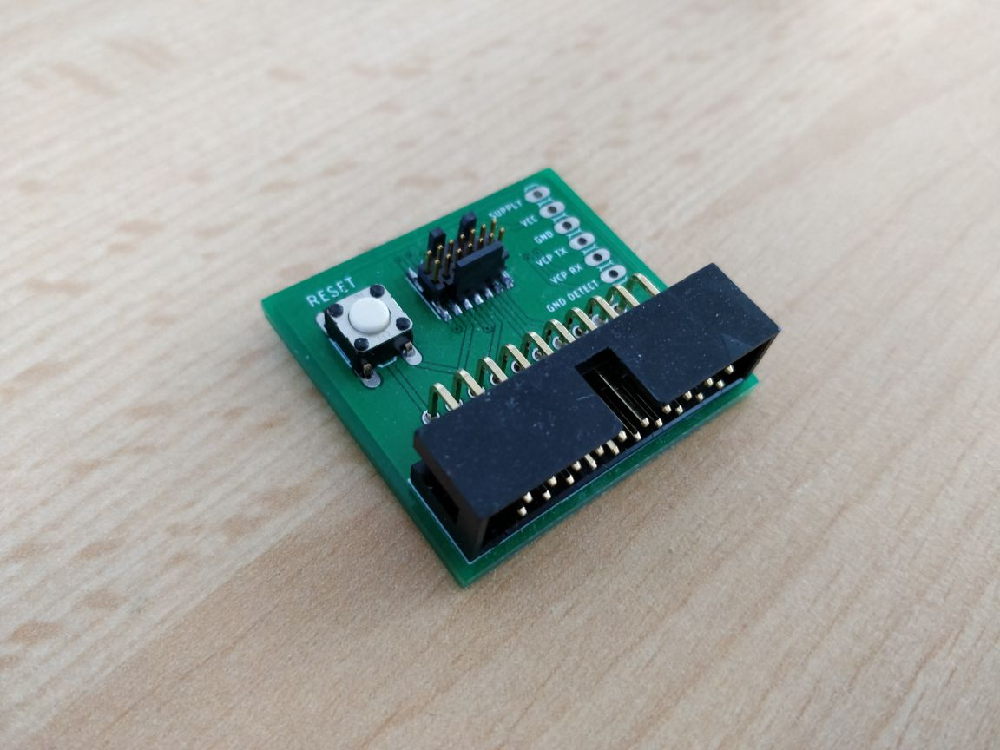

# stlink_14-20_converter
A converter pcb design to go from the 20-pin connector to the V3's 14-pin connector and vice versa

I don't really know eagle, but I think this is all you need for this to make this connector.
If you don't, just message me and I'll try to help!

You're free to use this design for whatever, just don't hold me liable for anything.
If you really want me to put up a licence, then contact me with a suggestion. All the default ones are for software...
